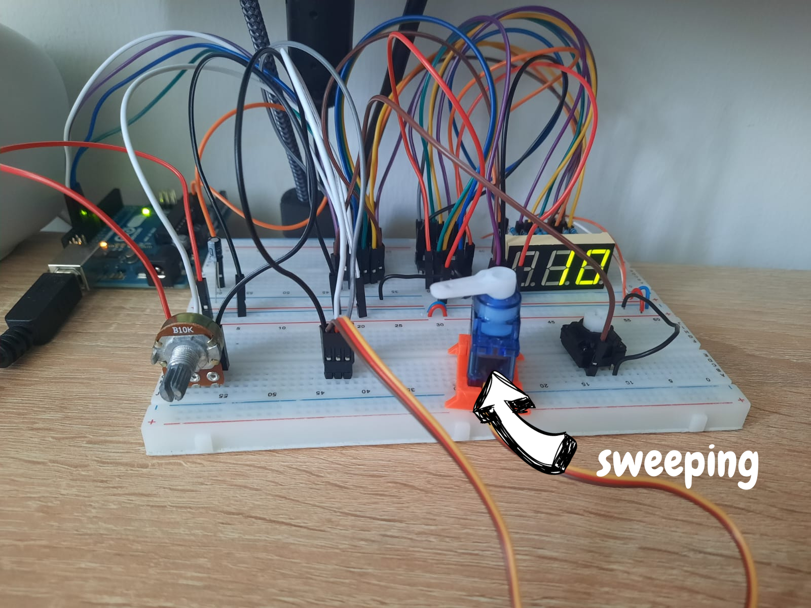
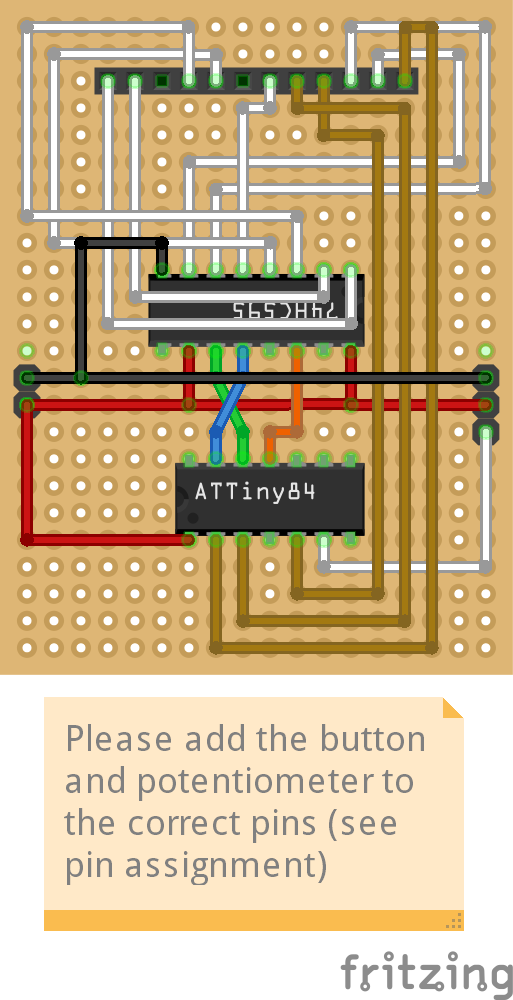
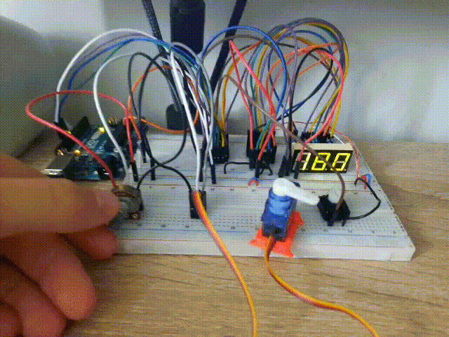
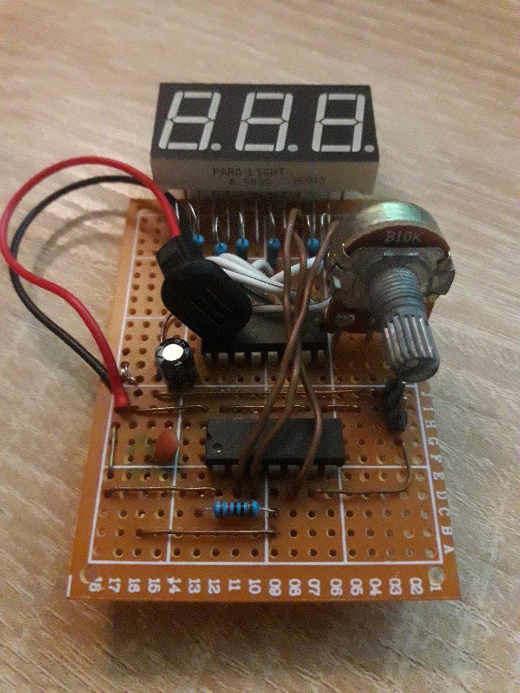

# ATtiny44 Multi-Mode Servo Tester

A compact and feature-rich **servo tester** built with an **ATtiny44A**, a **Paralight A-583G 7-segment display**, a **tactile switch**, and a **potentiometer**.  

This project was originally created as a stepping stone towards building a **Hexapod robot**.

---

## ✨ Features

- **Multiple modes of operation:**
  - **Manual Mode** – Direct servo angle control via potentiometer
  - **Sweep Mode** – Continuous sweep between servo limits, adjustable sweep speed
  - **Center Mode** – Instantly centers the servo at 90°
  - **Calibration Mode** – Save up to **3 custom min/max ranges** in EEPROM
- **Smooth PWM control** with ramping to prevent servo jitter
- **Angle feedback** shown on **3-digit 7-segment display**
- **EEPROM storage** for calibration presets
- Fully tested and working on a **breadboard!!**

---

## 🛠️ Hardware

- **Microcontroller:** ATtiny44A
- **Servo output:** PWM (Pin 3 / PA7)
- **Display:** Paralight A-583G 7-segment via shift register
- **Input:** Potentiometer + tactile button
- **Power:** 5V (USB or external supply, servo requires stable source)

> ⚠️ Note: Servos can draw high currents. When powering via USB, add capacitors to stabilize voltage drops caused by the servo load.

---

## 📐 Pinout

**ATtiny44A Pin Mapping:**

| ATtiny44A | Pin | Function |
|-----------|-----|----------|
| PB0       | 2   | D0 / Digit 1 |
| PB1       | 3   | D1 / Digit 2 |
| PB2       | 5   | D2 / Digit 3 |
| PB3       | 4   | RESET |
| PA0       | 13  | D10 / LATCH |
| PA1       | 12  | D9 / CLOCK |
| PA2       | 11  | D8 / DATA |
| PA3       | 10  | A3 / POT |
| PA4       | 9   | D6 |
| PA5       | 8   | D5 / BTN |
| PA6       | 7   | D4 / PWM |
| PA7       | 6   | D3 / PWM (Servo) |
| VCC       | 1   | 5V |
| GND       | 14  | Ground |

**Shift Register Pins:**

| Function | ATtiny44A Pin |
|----------|---------------|
| LATCH    | PA0 (D10)     |
| CLOCK    | PA1 (D9)      |
| DATA     | PA2 (D8)      |

**7-Segment Digit Select:**

| Digit | ATtiny44A Pin |
|-------|---------------|
| DIGIT 1 | PB0 (D0)    |
| DIGIT 2 | PB1 (D1)    |
| DIGIT 3 | PB2 (D2)    |

**Inputs & Outputs:**

| Signal | ATtiny44A Pin |
|--------|---------------|
| POT    | PA3 (A3)      |
| BTN    | PA5 (D5)      |
| SERVO  | PA7 (D3, PWM) |

---

## 📂 Project Files

- **Source Code** (`src/main.cpp`) – complete Arduino sketch
- **Images** – breadboard setup, soldered attempt, working prototype on breadboard!
- **GIF demo** – servo tester in action (from first devlog :D)

---

## ⚡ Notes & Limitations

- The **ATtiny44A is completely full** – the sketch uses nearly all available flash. Adding even a few bytes may exceed memory.
- My **perfboard soldered version** had issues due to poor soldering tools and limited space. It works fine on breadboard.
- Servo power requirements can cause instability. Add capacitors near the servo and display if needed.
- You can design your own PCB if you want a more reliable build.

---

## 🚀 Getting Started

1. Flash the **provided code** onto an ATtiny44A (via Arduino IDE or ISP programmer)
2. For now, set up the circuit on a **breadboard** using the Fritzing file as a guide. Don’t forget to wire the button and potentiometer to the **correct pins**, since they are NOT shown in the Fritzing file.
3. Connect a servo and power the board (preferably external 5V with sufficient current)
4. Use the button to **switch modes:**
   - Short press = mode toggle / sweep/manual
   - Long press = center
   - Double press = enter calibration

---

## 🧪 Status

- ✅ **Code tested and functional on breadboard**
- ⚠️ **Perfboard soldering version not fully working** (bugs)
- 🔜 Plan to complete a **final PCB version** in the future

---

## 📸 Media

### Servo Sweeping

### Fritzing Schematic

The 12pin female header demonstrates the 7segment display.

### Servo Tester Demo

### Prototype soldered (not fully working yet)

---

## 📖 License

MIT License – free to use, modify, and share.
